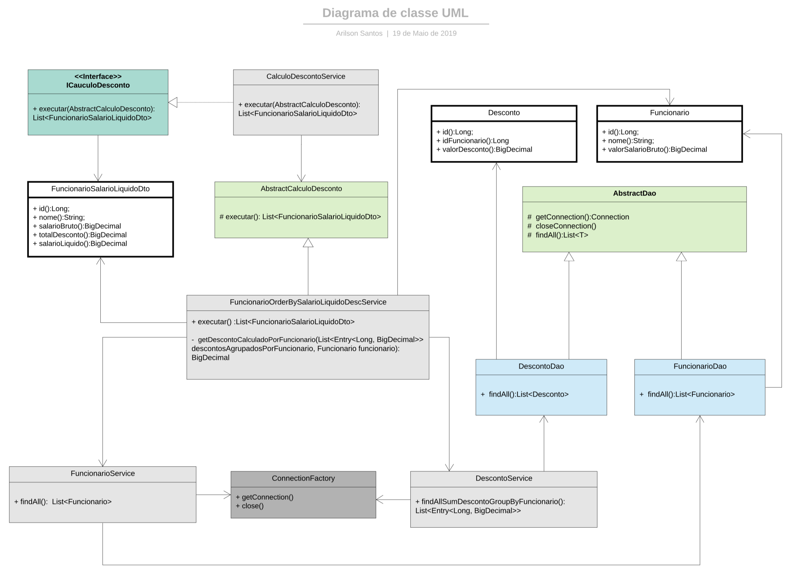

# Resolução do exercício

Instruções do exercício -> https://github.com/arilsonsantos/exercicio-strategy/blob/master/INSTRUCOES.md

## Diagrama de Classe
https://github.com/arilsonsantos/exercicio-strategy/master/imagens/diagramas/diagrama-de-classe.pdf

## Diagrama de Sequência
https://github.com/arilsonsantos/exercicio-strategy/blob/master/imagens/diagramas/diagrama-de-sequencia.pdf

## Breves instruções para download, compilação e execução

#### Pré-requisitos

##### Maven  -> (https://maven.apache.org/download.cgi)
##### Docker -> (https://hub.docker.com/)

##### Efetuar o clone do projeto através da URL https://github.com/arilsonsantos/exercicio-strategy

##### Acessar o diretório do projeto 

##### Digitar:
docker-compose up -d

mvn install

java -jar target/prova-java-1.0.0-jar-with-dependencies.jar

#### Exemplo de uma execução:

https://github.com/arilsonsantos/exercicio-strategy/blob/master/imagens/exemplo-execucao.png

